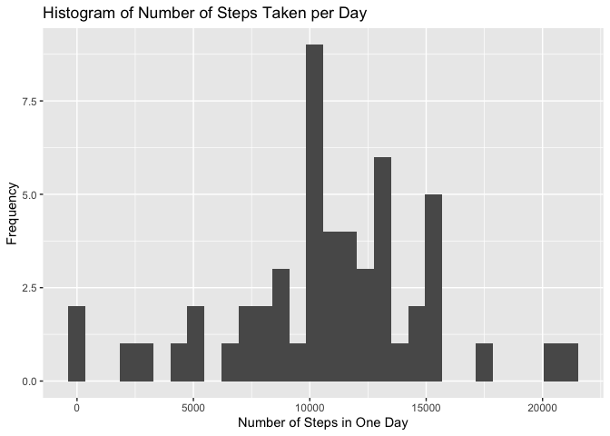
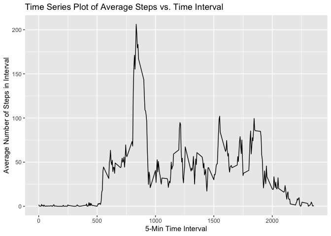
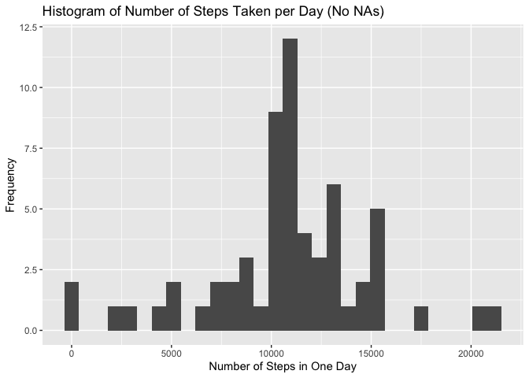
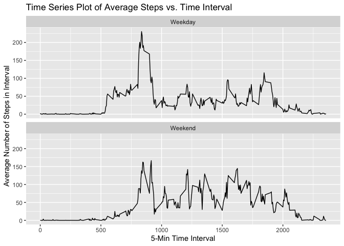

### Loading and preprocessing the data

```r
steps <- read.csv("./activity.csv")
summary(steps)
```

```
##      steps                date          interval     
##  Min.   :  0.00   2012-10-01:  288   Min.   :   0.0  
##  1st Qu.:  0.00   2012-10-02:  288   1st Qu.: 588.8  
##  Median :  0.00   2012-10-03:  288   Median :1177.5  
##  Mean   : 37.38   2012-10-04:  288   Mean   :1177.5  
##  3rd Qu.: 12.00   2012-10-05:  288   3rd Qu.:1766.2  
##  Max.   :806.00   2012-10-06:  288   Max.   :2355.0  
##  NA's   :2304     (Other)   :15840
```

Important information regarding the data:

* Consists of two months of data (October & November 2012)
* Number of steps taken in 5-minute intervals each day
* A total number of 288 interval observations per day
* The range of steps is from 0-806, with a mean of 37.38 and a median of 0
* There are 2304 NA step values
* The intervals, 0-2355, identify the same 5-minute interval each day (for example interval 5 on 10-1-2012 is the same time as interval 5 on 11-8-2012)

### What is mean total number of steps taken per day?
The mean total number of steps taken per day is...


```r
# 1. Calculate the number of steps taken per day
sums <- aggregate(steps$steps, by = list(Date = steps$date), sum)

# 2. Make a histogram of the total number of steps taken each day
sums %>%
        ggplot(aes(x)) +
        geom_histogram() +
        labs(title = "Histogram of Number of Steps Taken per Day", 
             x = "Number of Steps in One Day", y = "Frequency")
```

<!-- -->

```r
# 3. Calculate and report the mean and median of the total number of steps taken per day.

summary(sums)
```

```
##          Date          x        
##  2012-10-01: 1   Min.   :   41  
##  2012-10-02: 1   1st Qu.: 8841  
##  2012-10-03: 1   Median :10765  
##  2012-10-04: 1   Mean   :10766  
##  2012-10-05: 1   3rd Qu.:13294  
##  2012-10-06: 1   Max.   :21194  
##  (Other)   :55   NA's   :8
```

* The median number of steps over the 2-month period is **10,765 steps**.
* The mean number of steps over the 2-month period is **10,766 steps**.

### What is the average daily activity pattern?


```r
# 1. Make a time series plot (i.e. type = "1") of the 5-minute interval (x-axis) and the average number of steps taken, averaged across all days (y-axis)

avg_fivemin <- aggregate(steps$steps, by = list(Interval = steps$interval), mean, na.rm = TRUE)

avg_fivemin %>%
        ggplot(aes(x = Interval, y = x)) +
        geom_line() +
        labs(title = "Time Series Plot of Average Steps vs. Time Interval", 
             x = "5-Min Time Interval", y = "Average Number of Steps in Interval")
```

<!-- -->


```r
# 2. Which 5-minute interval, on average across all the days in the dataset, contains the maximum number of steps?
max(avg_fivemin$x)
```

```
## [1] 206.1698
```

```r
avg_fivemin$Interval[which.max(avg_fivemin$x)]
```

```
## [1] 835
```

On average across all of the days in the dataset, the 5-minute interval **835** contains the maximum average number of steps, at 206.1698.

### Imputing missing values


```r
# 1. Calculate and report the total number of missing values in the dataset (i.e. the total number of rows with NAs)

sum(apply(steps, 1, anyNA))
```

```
## [1] 2304
```

There are **2304 rows** with missing values in the dataset.


```r
# 2. Devise a strategy for filling in all of the missing values in the dataset.

## First, create a new column in original dataframe that maps average five-min
## interval step count to a new column

steps2 <- merge(steps, avg_fivemin, by.x = "interval", by.y = "Interval")

# 3. Create a new dataset that is equal to the original dataset with all the missing data filled in.

steps2$steps <- ifelse(is.na(steps2$steps), steps2$x, steps2$steps)
```


```r
# 4. Make a histogram of the number of steps taken each day.
# Calculate and report the mean and median total number of steps taken per day.

sums2 <- aggregate(steps2$steps, by = list(Date = steps2$date), sum)

sums2 %>%
        ggplot(aes(x)) +
        geom_histogram() +
        labs(title = "Histogram of Number of Steps Taken per Day (No NAs)", 
             x = "Number of Steps in One Day", y = "Frequency")
```

```
## `stat_bin()` using `bins = 30`. Pick better value with `binwidth`.
```

<!-- -->

```r
summary(sums2)
```

```
##          Date          x        
##  2012-10-01: 1   Min.   :   41  
##  2012-10-02: 1   1st Qu.: 9819  
##  2012-10-03: 1   Median :10766  
##  2012-10-04: 1   Mean   :10766  
##  2012-10-05: 1   3rd Qu.:12811  
##  2012-10-06: 1   Max.   :21194  
##  (Other)   :55
```

When the missing values are imputed, the mean total number of steps taken per day is **10,766**, while the median is **10,766**. Filling in the missing values removed any NA calculations from the average total number of steps taken per day, and it also caused the 1st and 3rd quartiles to shift to the right (increase).

### Are there differences in activity patterns between weekdays and weekends?


```r
# 1. Create a new factor variable in the dataset with two levels, indicating whether a given date is a weekday or weekend day.

## renaming column
names(steps2)[names(steps2) == "x"] <- "average_5min"


## Creating new columns to indicate day of the week & whether or not it is a weekday or a weekend
steps2$date <- strptime(as.character(steps2$date), "%Y-%m-%d")

steps2 <- steps2 %>%
        mutate(day_of_week = weekdays(steps2$date)) %>%
        mutate(is_weekday = ifelse(day_of_week == "Saturday" |
                                           day_of_week == "Sunday",
                                   "Weekend", "Weekday"))
```


```r
# 2. Make a panel plot containing a time series plot of the 5 minute interval
## and average number of steps taken, averaged across all weekdays or weekends.

## Find the average five-min interval steps given weekday or weekend
avg_fivemin_day <- aggregate(steps2$steps, by = list(interval = steps2$interval, is_weekday = steps2$is_weekday), mean, na.rm = TRUE)

avg_fivemin_day %>%
        ggplot(aes(x = interval, y = x)) +
        geom_line() +
        labs(title = "Time Series Plot of Average Steps vs. Time Interval", 
             x = "5-Min Time Interval",
             y = "Average Number of Steps in Interval") +
        facet_wrap(~is_weekday, ncol = 1)
```

<!-- -->
